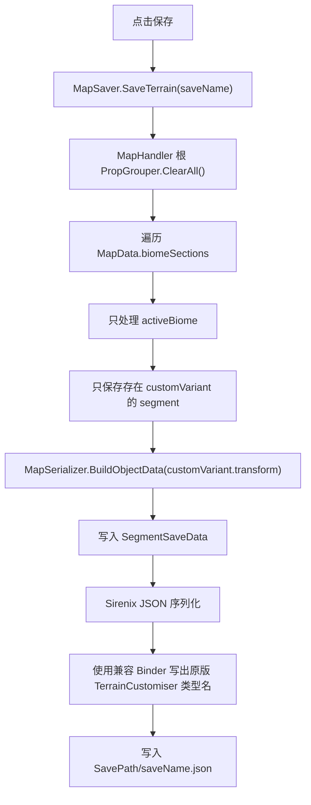
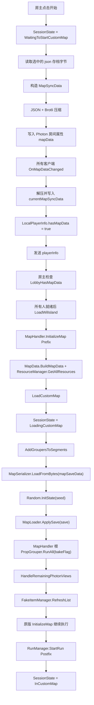

# TerrainCustomiserCN 运行逻辑说明

本文档记录 `TerrainCustomiserCN 0.1.2` 的主要运行链路，面向后续维护、排查联机兼容和定位地图加载问题。

TerrainCustomiserCN 的原则是：只汉化 UI 和少量显示行为，尽量保留原版 `TerrainCustomiser` 的地图存档、网络键、生成逻辑和交叉游玩能力。

## 1. 模块总览

### 主 DLL

`TerrainCustomiserCN.dll`

主插件负责：

- 注册 BepInEx 插件和 Harmony 补丁。
- 初始化配置、AssetBundle、玩家同步信息和 ImGui 窗口系统。
- 在机场界面提供“开始 / 编辑器”入口。
- 保存、读取、同步 TerrainCustomiser 地图数据。
- 在正式开局时应用自定义地图并重新生成地形。
- 将 TerrainCustomiser 的 UI、字段、类型、枚举和动态名称翻译为中文。

### 收集器 DLL

`TerrainCustomiserCNCollector.dll`

收集器只依赖主 DLL，用于发现漏翻 UI：

- 监听 `DisplayNameTranslator.MissingTranslationFound` 事件。
- 启动时反射扫描可编辑类型、字段和枚举。
- 运行中记录缺失翻译。
- 输出 `TerrainCustomiserCN_missing_translations.tsv`。

主 DLL 不读取这个 TSV 文件，因此不会因为收集器存在而在 UI 绘制时反复查文件。

## 2. 入口与初始化

入口文件：

- `TerrainCustomiserCN/Plugin.cs`
- `TerrainCustomiserCNCollector/Plugin.cs`

主插件声明：

```csharp
[BepInDependency("com.snosz.ubimgui")]
[BepInDependency("com.snosz.photoncustompropsutils")]
[BepInIncompatibility("com.snosz.terraincustomiser")]
[BepInPlugin("com.wuyachiyu.terraincustomisercn", "TerrainCustomiserCN", "0.1.2")]
```

含义：

- 依赖 `UBImGui` 提供 ImGui 绘制入口。
- 依赖 `PhotonCustomPropsUtils` 管理 Photon 房间属性和玩家属性。
- 与原版 `TerrainCustomiser` 标记为不兼容，避免同一客户端同时加载两套 Harmony 补丁。
- 版本号为 `0.1.2`。

`Plugin.Awake()` 的启动顺序：

1. 保存 `Plugin.Instance`。
2. `ConfigManager.Setup()` 绑定配置项。
3. `BundleManager.Setup()` 加载内嵌 AssetBundle。
4. `PlayerInfoManager.Setup()` 初始化本地玩家能力信息。
5. `Harmony.CreateAndPatchAll(...)` 注册所有补丁。
6. `WindowsManager.Setup()` 创建 ImGui 窗口管理对象。

`Plugin.OnDestroy()`：

1. 解除本 DLL 的 Harmony 补丁。
2. 卸载 AssetBundle。
3. 销毁 `EditorManager`。

## 3. 配置项

文件：

- `TerrainCustomiserCN/Managers/ConfigManager.cs`

配置项：

| 分组 | 键 | 作用 |
| --- | --- | --- |
| `General` | `EnableLightMapBaking` | 总开关。是否允许光照贴图烘焙。关闭后机场 UI 的烘焙选项也会被关闭。 |
| `UI` | `BakeLightMap` | 保存机场界面“烘焙光照贴图”的上次状态。 |
| `UI` | `UseRandomSeed` | 保存机场界面“随机种子”的上次状态。 |
| `UI` | `SeedToUse` | 保存机场界面“种子”的上次输入。 |

注意：`EnableLightMapBaking` 是能力开关，`BakeLightMap` 是用户在机场 UI 选择是否实际烘焙。

## 4. 状态机

文件：

- `TerrainCustomiserCN/Session/SessionState.cs`
- `TerrainCustomiserCN/Session/SessionActions.cs`

状态枚举：

| 状态 | 含义 |
| --- | --- |
| `InMainMenu` | 主菜单。 |
| `InAirport` | 机场空闲状态。 |
| `SelectingSave` | 正在选择地图存档。 |
| `ConfiguringCustomMap` | 已选存档，正在配置种子和烘焙选项。 |
| `WaitingToStartCustomMap` | 已准备启动自定义地图，等待玩家地图数据同步或等待加载岛屿。 |
| `LoadingCustomMap` | 正在正式加载自定义地图。 |
| `WaitingForMapData` | 客户端进入已有自定义地图大厅后，等待房主同步 `mapData`。 |
| `LoadingEditor` | 正在加载编辑器场景。 |
| `InCustomMap` | 已进入自定义地图游玩。 |
| `InEditor` | 已进入编辑器模式。 |

`SessionState.CanGenerate` 为真时，TerrainCustomiserCN 会接管生成链路：

```csharp
LoadingCustomMap || LoadingEditor || InEditor
```

这意味着：

- 正常游戏流程不被自定义生成补丁干扰。
- 只有编辑器加载、编辑器内生成、正式加载自定义地图时，`PropGrouper` / `PropSpawner` 相关 Harmony Prefix 才会替换原版行为。

## 5. Harmony 补丁入口

### 会话补丁

文件：

- `TerrainCustomiserCN/Patches/SessionPatches.cs`

关键补丁：

| Hook | 行为 |
| --- | --- |
| `MainMenu.Start` Postfix | 设置 `InMainMenu`。 |
| `RunManager.StartRun` Postfix | 根据当前状态进入编辑器或自定义地图。 |
| `PauseMenuMainPage.Quit` Postfix | 如果在编辑器中，结束编辑器会话。 |
| `SteamLobbyHandler.OnLobbyEnter` Postfix | 如果大厅标记 `TC_inCustomMap=true`，进入 `WaitingForMapData`。 |

### 机场补丁

文件：

- `TerrainCustomiserCN/Patches/AirportPatches.cs`

关键补丁：

| Hook | 行为 |
| --- | --- |
| `GameUtils.OnEnable` Postfix | 进入机场时调用 `SessionActions.OnAirportEnter()`。 |
| `BoardingPass.Initialize` Postfix | 注册 `AirportWindow`。 |
| `BoardingPass.OnOpen` Postfix | 房主打开 TerrainCustomiserCN 机场窗口。 |
| `BoardingPass.OnClose` Postfix | 房主关闭 TerrainCustomiserCN 机场窗口。 |
| `AirportCheckInKiosk.BeginIslandLoadRPC` Postfix | 开始加载岛屿后注销机场窗口。 |

### 网络补丁

文件：

- `TerrainCustomiserCN/Patches/NetworkPatches.cs`

关键补丁：

| Hook | 行为 |
| --- | --- |
| `GameHandler.Awake` Postfix | 初始化 `NetworkManager`。 |
| `GameUtils.OnPlayerLeftRoom` Postfix | 移除离开玩家的同步信息。 |

### ImGui 字体补丁

文件：

- `TerrainCustomiserCN/Patches/ImGuiPatches.cs`

`ImGuiTextures.BuildFontAtlas` Prefix 会调用 `ChineseFontManager.AppendChineseFont(...)`，把中文字体加入 UBImGui 字体图集。

## 6. 机场界面流程

文件：

- `TerrainCustomiserCN/UI/Windows/AirportWindow.cs`
- `TerrainCustomiserCN/UI/Modals/SaveSelectionModal.cs`

机场窗口只对房主打开。非房主不会直接操作开始或编辑器按钮。

### 空闲菜单

状态为 `InAirport` 或 `SelectingSave` 时显示：

- `开始`
- `编辑器`

点击 `开始`：

1. 打开存档选择弹窗。
2. 状态改为 `SelectingSave`。
3. 选中存档后，记录 `selectedSaveIndex`。
4. 状态改为 `ConfiguringCustomMap`。

点击 `编辑器`：

1. 状态改为 `LoadingEditor`。
2. 调用 `Plugin.Instance.LoadWilIsland()`。
3. 游戏开始加载 `WilIsland`，进入编辑器初始化链路。

### 游玩配置菜单

状态为 `ConfiguringCustomMap` 或 `WaitingToStartCustomMap` 时显示：

- 随机种子
- 种子
- 烘焙光照贴图
- 玩家列表和玩家能力状态
- 开始
- 取消

点击 `开始` 后：

1. 状态改为 `WaitingToStartCustomMap`。
2. 从 `MapSerializer.GetSave(selectedSaveIndex)` 读取 json 字节。
3. 如果启用随机种子，生成 `0..999999999` 的随机种子。
4. 构造 `MapSerializer.MapSyncData`：

```csharp
new MapSyncData
{
    bakeLightMap = bakeLightMap,
    seed = seedValue,
    mapSaveData = saveBytes
}
```

5. 调用 `NetworkUtils.SetMapDataRoomProperty(...)` 把地图同步到房间属性 `mapData`。

点击 `取消`：

1. 清空房间属性 `mapData`。
2. 状态回到 `InAirport`。

## 7. 网络同步逻辑

文件：

- `TerrainCustomiserCN/Managers/NetworkManager.cs`
- `TerrainCustomiserCN/Managers/PlayerInfoManager.cs`
- `TerrainCustomiserCN/Managers/ViewSyncManager.cs`
- `TerrainCustomiserCN/Utils/NetworkUtils.cs`

### PhotonCustomPropsUtils 管理器 ID

TerrainCustomiserCN 使用：

```csharp
PhotonCustomPropsUtilsPlugin.GetManager("com.snosz.terraincustomiser")
```

这不是 CN 自己的新 ID，而是沿用原版 TerrainCustomiser 的管理器 ID。

原因：让房间属性、玩家属性和原版 TerrainCustomiser 保持同一套通道，支持中英文版本交叉游玩。

### 房间属性

| 键 | 类型 | 作用 |
| --- | --- | --- |
| `mapData` | `byte[]` | 压缩后的 `MapSyncData`。 |
| `propViews` | `int[]` | 房主分配给自定义 PhotonView 的 ViewID 列表。 |

### 玩家属性

| 键 | 类型 | 作用 |
| --- | --- | --- |
| `playerInfo` | `byte[]` | Sirenix JSON 序列化后的 `PlayerInfo`。 |

`PlayerInfo` 包含：

| 字段 | 作用 |
| --- | --- |
| `canBake` | 当前玩家是否允许光照烘焙。 |
| `hasMapData` | 当前玩家是否已经收到并解压地图数据。 |

房主在 `OnPlayerInfoChanged` 中检查：

```csharp
PhotonNetwork.IsMasterClient
&& SessionState.Is(WaitingToStartCustomMap)
&& PlayerInfoManager.LobbyHasMapData
```

满足后调用 `Plugin.Instance.LoadWilIsland()`，正式开始加载岛屿。

### Steam 大厅标记

| 键 | 作用 |
| --- | --- |
| `TC_inCustomMap` | 标记当前大厅是否处于 TerrainCustomiser 自定义地图流程。 |

用途：

- 房主进入自定义地图后，把 `TC_inCustomMap` 设置为 `true`。
- 后加入玩家进入大厅时，如果看到该标记为 `true`，状态会进入 `WaitingForMapData`。
- 等待 `mapData` 到达后，客户端主动调用 `MapHandler.InitializeMap()` 走自定义地图加载流程。

## 8. MapSyncData 压缩和传输

文件：

- `TerrainCustomiserCN/Utils/NetworkUtils.cs`

流程：

```text
MapSyncData
  -> Newtonsoft.Json 序列化为 UTF-8 JSON
  -> BrotliStream 压缩
  -> 写入 Photon 房间属性 mapData
```

接收流程：

```text
Photon 房间属性 mapData
  -> BrotliStream 解压
  -> UTF-8 JSON 字符串
  -> Newtonsoft.Json 反序列化为 MapSyncData
  -> PlayerInfoManager.currentMapSyncData
```

这里的 Brotli 是为了降低 Photon 房间属性体积，尤其是地图 json 较大时比较关键。

## 9. 存档路径策略

文件：

- `TerrainCustomiserCN/Map/Serialization/MapSerializer.cs`

`MapSerializer.ResolveSavePath()` 返回 PEAK 的持久化数据目录：

`Application.persistentDataPath/TerrainCustomiser/Map Saves`

在 Windows 上通常对应：

`AppData\LocalLow\LandCrab\PEAK\TerrainCustomiser\Map Saves`

设计意图：

- 跟随原版 TerrainCustomiser `0.3.2` 的新地图目录。
- 让 TerrainCustomiserCN `0.1.2` 和原版 TerrainCustomiser `0.3.2` 共用同一份地图存档。
- 避免地图继续保存在 mod 管理器可能改名或清理的插件目录中。

## 10. 地图数据结构

文件：

- `TerrainCustomiserCN/Map/Serialization/MapSerializer.cs`

核心结构：

```csharp
MapSaveData
{
    string MapName;
    List<SegmentSaveData> Segments;
}

SegmentSaveData
{
    int SectionIndex;
    int SegmentIndex;
    Biome.BiomeType BiomeType;
    ObjectData CustomVariant;
}

ObjectData
{
    string Id;
    string Name;
    TransformData Transform;
    List<ComponentData> Components;
    List<ObjectData> Children;
}

ComponentData
{
    Type Type;
    List<FieldData> Fields;
}

FieldData
{
    string Name;
    Type Type;
    object Value;
}
```

重点：

- 保存的是自定义变体的 GameObject 层级、组件和字段。
- 不是保存正式游玩中的最终可见地形快照。
- PhotonView 在保存前会把 `ViewID` 和 `sceneViewId` 清零，避免把旧网络 ID 写进存档。

## 11. 序列化兼容机制

文件：

- `TerrainCustomiserCN/Utils/TerrainCustomiserSerialization.cs`

TerrainCustomiserCN 的类名和程序集名是：

```text
TerrainCustomiserCN...
TerrainCustomiserCN.dll
```

原版 TerrainCustomiser 的类名和程序集名是：

```text
TerrainCustomiser...
TerrainCustomiser.dll
```

如果直接用 CN 类型名写入 json，原版 TerrainCustomiser 就无法读取。

为了解决这个问题，CN 使用 `TerrainCustomiserCompatibilityBinder`：

- 保存时：把 CN 类型名替换为原版 TerrainCustomiser 类型名。
- 读取时：把原版 TerrainCustomiser 类型名映射回 CN 类型。

已映射类型包括：

- `PlayerInfo`
- `MapSerializer.ObjectData`
- `MapSerializer.TransformData`
- `MapSerializer.ComponentData`
- `MapSerializer.FieldData`
- `MapSerializer.MapSaveData`
- `MapSerializer.MapSyncData`
- `MapSerializer.SegmentSaveData`

这个设计是 TerrainCustomiserCN 与原版 TerrainCustomiser 共用地图和房间数据的核心。

## 12. 编辑器模式加载链路

入口：

- 机场点击 `编辑器`

流程：

```mermaid
flowchart TD
    A["机场点击编辑器"] --> B["SessionState = LoadingEditor"]
    B --> C["Plugin.LoadWilIsland()"]
    C --> D["AirportCheckInKiosk.BeginIslandLoadRPC(\"WilIsland\", ascentIndex, settings)"]
    D --> E["MapHandler.InitializeMap Prefix"]
    E --> F["MapData.BuildMapData()"]
    E --> G["ResourceManager.GetAllResources()"]
    E --> H["放行原版 InitializeMap"]
    H --> I["RunManager.StartRun Postfix"]
    I --> J["SessionActions.OnStartRun()"]
    J --> K["EditorManager.Setup()"]
    K --> L["SessionState = InEditor"]
```

`EditorManager.Setup()`：

1. 设置状态为 `InEditor`。
2. 给 `Plugin.Instance.gameObject` 添加 `EditorManager`。
3. `EditorManager.Start()` 调用 `PrepareEditorMode()`。

`PrepareEditorMode()` 做的事：

- 绑定暂停输入。
- 关闭雾效、侦察员、本地角色和游戏 HUD。
- 反射收集所有 `LevelGenStep` 派生类型。
- 禁用 inactive variant segments。
- 清空 globalParent 的生成结果。
- 创建 `MenuWindow`。
- 注册窗口：
  - `InspectorWindow`
  - `FreeCamWindow`
  - `EditorWindow`
  - `ResourceWindow`
- 绑定层级选择和辅助线刷新。

编辑器内点击 `生成`：

```csharp
currentSegment.transform.GetComponentInParent<PropGrouper>().RunAll(false);
```

由于此时 `SessionState = InEditor`，`SessionState.CanGenerate = true`，所以会走 TerrainCustomiserCN 的 `PropGrouper.RunAll` Prefix。

## 13. 编辑器窗口职责

### EditorWindow

文件：

- `TerrainCustomiserCN/UI/Windows/EditorWindow.cs`

职责：

- 显示生成、保存、加载、相机、辅助线按钮。
- 显示 BiomeSection / Biome / Segment 表格。
- 支持切换 Biome。
- 支持创建、删除自定义变体。
- 显示当前自定义变体下的生成器层级。
- 右键创建生成器、分组器、复制、重命名、删除。

### InspectorWindow

文件：

- `TerrainCustomiserCN/UI/Windows/InspectorWindow.cs`

职责：

- 显示当前选中对象的可编辑组件。
- 支持编辑：
  - `Transform`
  - `PropGrouper`
  - `LevelGenStep` 派生类型
  - `RockMaterialSwapper`
  - `SpecialDayZone`

字段 UI 由 `WidgetFactory` 根据字段类型动态生成。

### ResourceWindow

文件：

- `TerrainCustomiserCN/UI/Windows/ResourceWindow.cs`

职责：

- 给 `GameObject`、`Material`、`Transform` 等字段选择资源。
- 资源列表来自 `ResourceManager` 或当前 Map 层级。
- 筛选同时匹配英文原名和中文显示名。

### FreeCamWindow

文件：

- `TerrainCustomiserCN/UI/Windows/FreeCamWindow.cs`

职责：

- 修改自由相机的视角灵敏度、视角阻尼、移动力度和移动阻尼。

## 14. 地图保存流程

入口：

- 编辑器点击 `保存`
- `SaveModal` 调用 `MapSaver.SaveTerrain(saveName)`

文件：

- `TerrainCustomiserCN/Map/MapSaver.cs`

流程：



重要细节：

- 保存前会调用 `ClearAll()`。
- 保存的是自定义变体层级和生成器参数。
- 不会把当前运行时已经生成出来的所有可见子物体当作最终快照保存。

这也是某些关卡“预览看起来生效、正式游玩重新生成后不同”的根本背景之一。

## 15. 地图加载流程

入口：

- 编辑器中点击 `加载`
- 正式游玩中 `LoadCustomMap()`

文件：

- `TerrainCustomiserCN/Map/MapLoader.cs`

`MapLoader.ApplySave(save)` 流程：

1. `MapHandler` 根 `PropGrouper.ClearAll()`。
2. 遍历所有 `MapData.biomeSections`。
3. 删除现有 custom variant。
4. 遍历存档中的 `save.Segments`。
5. 根据 `SectionIndex` 找到 `BiomeSection`。
6. 根据 `BiomeType` 找到目标 `BiomeOption`。
7. 如果当前 active biome 不同，才调用 `MapManager.ChangeBiome(...)` 切换到存档指定 Biome，避免同一 biome 下多个自定义段互相清除。
8. 根据 `SegmentIndex` 找到目标 segment。
9. 关闭当前 active variant。
10. `RebuildObjectData(seg.CustomVariant)` 重建自定义 GameObject 层级。
11. 重建对象命名为 `Custom`。
12. 挂到目标 segment 下。
13. 创建新的 `MapData.SegmentVariant` 并加入 `variants`。
14. 确保根对象有 `BiomeVariant` 和 `PropGrouper`。
15. 递归启用自定义对象。
16. 清空临时引用缓存。

`RebuildObjectData(...)` 会：

- 创建或复用 GameObject。
- 恢复 local position、rotation、scale。
- 按 `ComponentData.Type` 添加组件。
- 用反射恢复字段值。
- 递归恢复子对象。

字段恢复失败时会吞掉异常，因此部分字段如果类型不兼容或运行时对象无法恢复，可能静默丢失。

## 16. 正式游玩自定义地图流程

入口：

- 机场点击 `开始`
- 所有玩家收到 `mapData`
- 房主确认所有玩家 `hasMapData=true`
- 调用 `Plugin.LoadWilIsland()`

核心文件：

- `TerrainCustomiserCN/UI/Windows/AirportWindow.cs`
- `TerrainCustomiserCN/Managers/NetworkManager.cs`
- `TerrainCustomiserCN/TerrainGeneration/GenerationPatches.cs`
- `TerrainCustomiserCN/Session/SessionActions.cs`

完整流程：



### MapHandler.InitializeMap Prefix

文件：

- `TerrainCustomiserCN/TerrainGeneration/GenerationPatches.cs`

逻辑：

```text
如果 WaitingForMapData：
    返回 false，阻止原版 InitializeMap，等 mapData 到达后再初始化

否则，如果 LoadingEditor 或 WaitingToStartCustomMap：
    BuildMapData()
    GetAllResources()

如果不是 WaitingToStartCustomMap：
    返回 true，放行原版 InitializeMap

如果是 WaitingToStartCustomMap：
    LoadCustomMap()
    返回 true，继续原版 InitializeMap
```

注意：正式自定义地图加载后仍返回 `true`，也就是原版 `MapHandler.InitializeMap()` 还会继续执行。原版主要负责初始段落启用/禁用、初始状态等，不是重新保存或覆盖自定义存档。

### LoadCustomMap

`LoadCustomMap()` 的实际顺序：

```csharp
SessionState.Set(LoadingCustomMap);
AddGroupersToSegments();
save = MapSerializer.LoadFromBytes(currentMapSyncData.mapSaveData);
Random.InitState(currentMapSyncData.seed);
MapLoader.ApplySave(save);
rootGrouper.RunAll(bakeFlag);
HandleRemainingPhotonViews();
FakeItemManager.Instance.RefreshList();
```

这说明正式游玩时不是单纯把 json 里的对象摆回场景，而是：

1. 先重建自定义生成器层级。
2. 再对整张地图根 `PropGrouper` 执行一次生成。

## 17. 生成链路补丁

文件：

- `TerrainCustomiserCN/TerrainGeneration/GenerationPatches.cs`

### PropGrouper.RunAll

当 `SessionState.CanGenerate=false`：

- 返回 `true`，放行原版 `PropGrouper.RunAll`。

当 `SessionState.CanGenerate=true`：

- 阻止原版 `RunAll`。
- 自己执行生成流程：
  1. 清空 deferred step 列表。
  2. `__instance.ClearAll()`。
  3. 找出所有子 `LevelGenStep`。
  4. 按最近父级 `PropGrouper.timing` 分为 Early 和 Late。
  5. 先执行 Early steps。
  6. 收集并执行 `AfterCurrentGroupTiming` deferred steps。
  7. 可选执行 `LightMapBaker.RunBake()`。
  8. 再执行 Late steps。
  9. 返回 `false`，阻止原版继续执行。

### PropSpawner / PropSpawner_Sphere

当 `SessionState.CanGenerate=false`：

- 放行原版。

当 `SessionState.CanGenerate=true`：

- 对部分安全场景使用 Job + RaycastCommand 批量射线，提高生成性能。
- 对不适合批处理的情况放行原版。
- 执行 modifiers、constraints、postConstraints、postSpawnBehaviors。

### LevelGenStep Spawn Patch

目标：

- 自动 patch 所有 `LevelGenStep` 派生类型中签名为 `Spawn(PropSpawner.SpawnData)` 且返回 `GameObject` 的方法。

作用：

- 在 `CanGenerate=true` 时，统一走 `PropSpawnerHelpers.TrySpawn(...)`。
- 保持 modifiers 和 postConstraints 处理一致。

### 空 props 防护

对以下方法加 Prefix：

- `PropSpawner.Execute`
- `PropSpawner_Sphere.Execute`
- `PropSpawner_Line.Execute`

如果 `props == null` 或 `props.Length == 0`：

- 打日志。
- 返回 `false`，阻止继续执行，避免空数组导致异常。

## 18. PhotonView 同步

文件：

- `TerrainCustomiserCN/Managers/ViewSyncManager.cs`
- `TerrainCustomiserCN/TerrainGeneration/GenerationPatches.cs`

正式加载地图后，`HandleRemainingPhotonViews()` 会：

1. 找出 `MapHandler` 下所有 `ViewID == 0` 的 `PhotonView`。
2. 加入 `ViewSyncManager.pendingViews`。
3. 调用 `ViewSyncManager.HandlePendingViews()`。

房主逻辑：

1. 给每个 pending view 分配新的 Photon ViewID。
2. 把 ID 数组写入房间属性 `propViews`。
3. 清空 pending。

客户端逻辑：

1. 接收 `propViews`。
2. 如果本地 pending views 和 ID 数量一致，按顺序套用 ViewID。
3. 如果数量不一致，打错误日志，地图可能不同步。

## 19. 翻译系统

文件：

- `TerrainCustomiserCN/UI/DisplayNameTranslator.cs`
- `TerrainCustomiserCN/UI/ImGuiHelpers.cs`
- `TerrainCustomiserCN/UI/WidgetFactory.cs`
- `TerrainCustomiserCNCollector/Plugin.cs`

翻译类型：

| 类型 | 用途 |
| --- | --- |
| `Ui` | 固定 UI 文本。 |
| `Field` | 字段名。 |
| `Type` | 类型名。 |
| `Enum` | 枚举值。 |
| `Dynamic` | 动态对象名、资源名、Biome 名、Segment 名等。 |

主 MOD 在绘制 UI 时通过 `DisplayNameTranslator` 取中文显示名。

如果找不到翻译：

1. 返回原始文本或格式化后的文本。
2. 触发 `MissingTranslationFound` 事件。
3. 如果 Collector 已启用，就把缺失项写入 TSV。

Collector 的静态扫描会提前扫：

- `LevelGenStep`
- `PropSpawnerMod`
- `PropSpawnerConstraint`
- `PropSpawnerConstraintPost`
- `PostSpawnBehavior`
- `PropGrouper`
- `RockMaterialSwapper`
- `SpecialDayZone`

这样可以在运行 UI 前发现很多字段和枚举漏翻。

## 20. 与原版 TerrainCustomiser 的兼容边界

TerrainCustomiserCN 为了和原版交叉游玩，刻意保留以下兼容点：

- 使用原版 PhotonCustomPropsUtils manager ID：`com.snosz.terraincustomiser`。
- 使用原版房间属性键：
  - `mapData`
  - `propViews`
- 使用原版玩家属性键：
  - `playerInfo`
- 使用原版 Steam 大厅标记：
  - `TC_inCustomMap`
- 读取原版 `0.3.2` 相同的持久化地图目录：
  - `AppData\\LocalLow\\LandCrab\\PEAK\\TerrainCustomiser\\Map Saves`
- 保存 json 时写回原版 TerrainCustomiser 类型名。

不兼容点：

- 同一个客户端不能同时加载 TerrainCustomiserCN 和原版 TerrainCustomiser。
- 代码通过 `[BepInIncompatibility("com.snosz.terraincustomiser")]` 明确标记。

交叉游玩方式：

- A 玩家启用 TerrainCustomiserCN。
- B 玩家启用原版 TerrainCustomiser。
- 两边都不要同时启用对方版本。
- 存档和房间同步数据仍使用原版数据结构和网络键。

## 21. 已知运行特性和风险点

### 保存不是最终地形快照

TerrainCustomiserCN 保存的是自定义变体的生成器层级和字段，不是游玩时最终生成出的完整实体快照。

因此正式游玩时会重新执行：

```text
MapLoader.ApplySave(save)
root PropGrouper.RunAll(...)
```

这会导致部分依赖运行时上下文、物理射线、原版特殊生成逻辑的段落，在编辑器预览和正式游玩中表现不同。

### 第四关 Volcano / Caldera 风险

第 4 关相关地图段包含大量 lava、bridge、magma rock、variant segment 等特殊生成内容。

当前 MOD 只是汉化和兼容适配，不修复原版 TerrainCustomiser 对这些特殊段落的生成支持问题。

表现可能是：

- 预览或编辑时看起来生效。
- 正式游玩重新生成后部分改动失效。
- 跳转或激活到该段时显示接近原版。

### 静默字段恢复失败

`MapLoader.RebuildObjectData()` 用反射恢复字段：

```csharp
try
{
    field.SetValue(obj, value);
}
catch
{
}
```

如果字段类型不匹配、目标字段不存在或引用无法恢复，当前逻辑会静默跳过。

这保持了兼容性，但排查问题时需要注意：json 中有字段不代表运行时一定成功恢复。

### PhotonView 顺序要求

`propViews` 同步依赖房主和客户端收集 pending views 的顺序一致。

如果生成链路不一致，可能出现：

```text
ID Count mismatch! Map will be out of sync!
```

这通常意味着主客机生成出的带 PhotonView 对象数量或顺序不一致。

## 22. 主要运行链路速查

### 进入机场

```text
GameUtils.OnEnable
  -> SessionActions.OnAirportEnter()
  -> InAirport
  -> 房主清空 mapData
  -> TC_inCustomMap=false
```

### 编辑器

```text
机场 编辑器
  -> LoadingEditor
  -> LoadWilIsland
  -> MapHandler.InitializeMap Prefix
  -> BuildMapData + GetAllResources
  -> RunManager.StartRun Postfix
  -> EditorManager.Setup
  -> InEditor
```

### 保存地图

```text
SaveModal
  -> MapSaver.SaveTerrain
  -> ClearAll
  -> 遍历 activeBiome customVariant
  -> BuildObjectData
  -> Sirenix JSON + 兼容 Binder
  -> 写入 AppData\\LocalLow\\LandCrab\\PEAK\\TerrainCustomiser\\Map Saves
```

### 加载地图到编辑器

```text
LoadModal
  -> MapSerializer.LoadSave
  -> MapLoader.ApplySave
  -> 删除旧 Custom
  -> 切换 Biome
  -> 重建 Custom Variant
```

### 正式游玩

```text
AirportWindow.OnPlayClicked
  -> mapSaveData + seed + bakeLightMap
  -> Brotli mapData
  -> PlayerInfo.hasMapData
  -> 房主等待 LobbyHasMapData
  -> LoadWilIsland
  -> LoadCustomMap
  -> ApplySave
  -> root RunAll
  -> PhotonView ID 同步
  -> InCustomMap
```

## 23. 排查问题建议

### UI 漏翻

看：

- `TerrainCustomiserCN_missing_translations.tsv`
- `DisplayNameTranslator.cs`
- `TerrainCustomiserCNCollector/Plugin.cs`

### 存档无法共用

先看：

- `MapSerializer.ResolveSavePath()`
- `TerrainCustomiserCompatibilityBinder`
- json 中 `$type` 是否仍是 `TerrainCustomiser...`

### 主客机不同步

先看日志：

- 是否有 `ID Count mismatch`
- `Compressed MapSyncData Size`
- 玩家 `hasMapData` 是否都为 true

重点代码：

- `NetworkManager.OnMapDataChanged`
- `PlayerInfoManager.LobbyHasMapData`
- `ViewSyncManager.HandlePendingViews`

### 预览和正式游玩不同

先判断是否是生成链路差异：

- 编辑器预览：当前 segment 或已加载层级。
- 正式游玩：`ApplySave` 后整张图根 `PropGrouper.RunAll`。

重点代码：

- `MapSaver.SaveTerrain`
- `MapLoader.ApplySave`
- `MapHandlerInitializeMapPatch.LoadCustomMap`
- `PropGrouperRunAllPatch`

### 某个字段存了但运行时没生效

看：

- json 中 `ComponentData.Fields`
- 游戏版本中对应字段是否仍存在
- `MapLoader.RebuildObjectData()` 是否可能静默跳过字段恢复

## 24. 维护原则

后续改动建议继续遵守：

1. 不改原版网络键，除非明确放弃与 TerrainCustomiser 交叉游玩。
2. 不改地图 json 的原版类型名输出。
3. 不把 UI 翻译写入地图内部参数。
4. 不在主 DLL 运行时读取漏翻 TSV。
5. 新增翻译优先放进 `DisplayNameTranslator`，Collector 只负责发现缺失。
6. 修改生成链路前，先确认是否会影响主客机 deterministic 生成和 PhotonView 数量顺序。
7. 发布说明中每次写明 TerrainCustomiserCN 版本对应的原版 TerrainCustomiser 版本。

