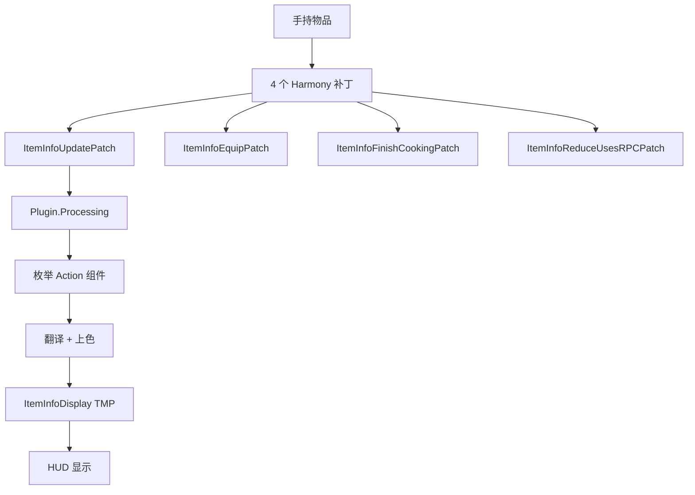

# ItemInfoCN

更新时间：2026-05-08

## 项目定位

PEAK 物品信息中文化 HUD MOD。在原版 ItemPromptLayout 下挂一个 `TextMeshProUGUI`，把手持物品的 Action 组件翻译成中文说明，带效果色高亮。

- GUID：`com.wuyachiyu.ItemInfoCN`
- AssemblyName：`ItemInfoCN`
- 版本：`1.0.0`
- 发行包：`MOD开发\ItemInfoCN\发行\1.0.0\`（含 README + manifest.json + CHANGELOG + icon）

## 功能轮廓

## 入口与挂载

- `Plugin.Awake()`：绑定 5 个 `ConfigEntry`（字号/描边/行距/宽度/强制刷新），执行四组 `Harmony.CreateAndPatchAll`。
- `AddDisplayObject()`：等场景里 `GAME/GUIManager` + `Canvas_HUD/Prompts/ItemPromptLayout` 就绪后，把 `ItemInfoDisplay` 子物体挂上去。**前置判空**，场景没就绪直接 return，避免 NRE 循环刷错。
- `EasyBackpack` 兼容：启动时检查 `nickklmao.easybackpack` 是否在列，按情况微调渲染。

## 翻译与配色

- 效果中文映射：`GetEffectChineseName`（Hunger/Injury/Curse/Cold/Hot/Heat/Shield/ExtraStamina/Thorns/Spores/Poison/Drowsy）。
- 效果色表：`InitEffectColors` 注入 17 条 `<#RRGGBB>` 色条，正负面分别用 `#DDFFDD` / `#FFCCCC` 兜底。
- 组件识别：`GetComponentEffectInfo` 识别 `Action_RestoreHunger` / `Action_GiveExtraStamina` / `Action_InflictPoison` / `Action_AddOrRemoveThorns` / `Action_ModifyStatus`；未命中走 `componentType.Name` 兜底。

## 接手要求

- 修改翻译/配色 → 改 `Plugin.cs` 的 `GetEffectChineseName` 或 `InitEffectColors`；改完更新 `RECENT.md` 和发行包 `CHANGELOG.md`。
- 新增一类物品 Action → 在 `Plugin.Processing.cs` 和 `ItemInfoPatches.cs` 补分支。
- 所有改动走四同步（update_memory + MD + MEMORY_INDEX + CHANGELOG）。
