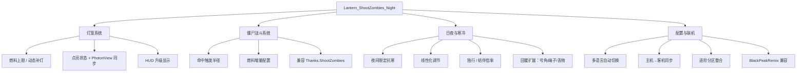

# Lantern_ShootZombies_Night

更新时间：2026-05-08

## 项目定位

对应源码目录 `MOD开发\Lantern&ShootZombies&Night\`。这个 MOD 整合了**灯笼、打僵尸、日夜循环、寒冷/回暖、联机配置同步**这一大片功能，是当前所有 MOD 里业务最复杂的一个。

之所以四块耦合在一个 MOD 里，是因为它们共享同一个**主机→客户端配置同步**链路和同一套**夜间条件开关**。拆了反而要维护两套同步。

## 当前状态

- 版本号：`.csproj` 和插件常量均为 `0.2.1`。
- 历史上重要的阶段性结论见 `RECENT.md`，设计边界见 `DECISIONS.md`，源码布局见 `FILES.md`。
- 与 `PlayersInfo` 通过灯笼状态同步层（`LanternBroadcastReceiver`）衔接；与 `WhySoLaggy` 可联合用于 RPC/补丁归因诊断。

## 功能轮廓

## 已移除或不存在的功能（别恢复）

- **燃尽惩罚系统**：0.0.1 版本已彻底移除，不要再加回。
- **被动清寒系统**：0.0.1 版本已彻底移除。
- **白天抗寒**：长期限定为**夜间生效**，白天不加暖。

## 接手必读

- `FILES.md`：源码、输出路径、关键 Helper 文件清单。
- `RECENT.md`：近期版本的功能演进和验证结论。
- `DECISIONS.md`：已确认的技术决策和禁止回退项。
- 根 `TODO.md`：未完成、待验证项。

## 跨 MOD 关系

- **PlayersInfo**：通过 `LanternBroadcastReceiver` 读灯笼点亮/燃料状态，HUD 展示。别越过这层直接去 hook 对方内部字段。
- **WhySoLaggy**：联机卡顿、RPC 异常时用它归因。它的 `RpcMonitor` 能抓到本 MOD 所有对外 RPC 的调用情况。
- **BlackPeakRemix（BPR）**：作为外部依赖 MOD，功能上有重叠的部分（灯笼）必须做兼容检测而不是硬覆盖。
- **Thanks.ShootZombies**：打僵尸的原 MOD，本 MOD 的 ShootZombies 功能参考它但独立实现。
