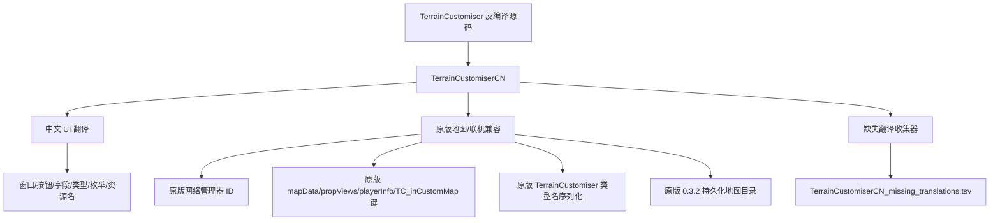

# TerrainCustomiserCN

更新时间：2026-05-30

## 项目定位

`TerrainCustomiserCN` 是 snozz 原版 `TerrainCustomiser` 的中文 UI 版本。当前目标是翻译编辑器界面、按钮、字段、类型、枚举、资源显示名和相关弹窗，并同步对应原版版本中必要的兼容修复；不做 CN 专属地图格式、联机协议、序列化字段或玩法改造。

注意：memory 里 2026-05-12 前后的 `TerrainCustomiserCN -> DreamyAscent` 是另一个历史项目改名记录。当前这个 `TerrainCustomiserCN` 是 2026-05-23 重新建立的独立中文 UI 版项目，不要和 DreamyAscent 的历史迁移入口混淆。

- GUID：`com.wuyachiyu.terraincustomisercn`
- AssemblyName：`TerrainCustomiserCN`
- Collector GUID：`com.wuyachiyu.terraincustomisercn.collector`
- Collector AssemblyName：`TerrainCustomiserCNCollector`
- 当前版本：`0.1.2`
- 对应原版：`TerrainCustomiser 0.3.2`
- Collector 版本：`0.1.1`
- 源码目录：`MOD开发\TerrainCustomiserCN`
- 发布目录：`MOD开发\TerrainCustomiserCN\发布\0.1.2`
- 发布包：`wuyachiyu-TerrainCustomiserCN-0.1.2.zip`

## 功能轮廓

## 接手入口

1. 先读 `RECENT.md`，确认当前发布状态和最近改动。
2. 再读 `DECISIONS.md`，尤其是兼容性禁止回退项。
3. 修改源码前读 `FILES.md`，确认构建输出和关键文件。
4. 若上下文压缩或换 AI，先读 `temp/current.md`。

## 玩家侧说明

- 不能和原版 `TerrainCustomiser` 在同一个客户端同时启用。
- 已按实测口径说明：一人使用 TerrainCustomiserCN、另一人使用原版 TerrainCustomiser 可以交叉游玩并共用地图数据；每次更新都必须写明对应的原版 TerrainCustomiser 版本。
- `TerrainCustomiserCN 0.1.2` 对应原版 `TerrainCustomiser 0.3.2`，两者地图保存目录一致：`%USERPROFILE%\AppData\LocalLow\LandCrab\PEAK\TerrainCustomiser\Map Saves`。
- 旧版本或旧管理器环境里可能存在插件目录下的 `Map Saves`，0.1.2 不自动迁移旧地图；如果玩家报告地图缺失，先检查新持久化目录和旧插件目录。
- CN 列表额外支持在开始游玩时读取 `.json.old` 只读备份文件，显示为 `[只读备份]`；编辑器仍只编辑正常 `.json`，不会复制、改名、删除或恢复 `.json.old`。
- `0.1.2` 已同步原版 `0.3.2` 的 Caldera/Volcano 自定义变体同时生效修复。如果第四关仍有预览和游玩不一致，要优先对照原版行为判断，不要默认在 CN 里改玩法。
- 漏翻反馈走 QQ 群 `1093172647`，同时可提供 `TerrainCustomiserCN_missing_translations.tsv`。

## 维护要求

- 每次更新版本都必须同步 `.csproj`、BepInEx 插件属性、AssemblyInfo、发布目录 `manifest.json` / `README.md` / `CHANGELOG.md` 和本 memory。
- 每次原版 TerrainCustomiser 更新后，必须先确认原版版本号、网络键、序列化类型、地图保存结构和核心修复点是否变化，再决定 CN 对应升版内容。
- 任何影响地图数据、Photon/Steam 同步、保存目录、序列化 binder 的改动，都必须先评估 TerrainCustomiserCN 与原版 TerrainCustomiser 的交叉游玩风险。
