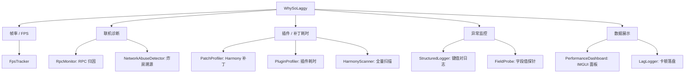

# WhySoLaggy

更新时间：2026-05-08

## 项目定位

PEAK 的**性能、网络、RPC、Harmony 和异常行为观测** MOD。定位是项目的"体检仪"，其他 MOD 出性能问题或联机异常时，先挂 WhySoLaggy 抓数据，再定位根因。

本 MOD 不做业务逻辑修改，只做诊断输出。

## 当前状态

- 版本号：`.csproj` 记录为 `1.0.3`。
- 版本号一致性治理已完成：代码注释、CHANGELOG、README 全部统一到 `1.0.3`，不存在旧版本号漂字符串。
- 诊断模块见 `FILES.md` 的关键源码清单。

## 能力矩阵

## 用法速查

- **卡顿归因**：看 `PerformanceDashboard` 左上角的 IMGUI 通知（堆叠 + 淡出）。
- **RPC 异常**：查 `RpcMonitor` 输出，单玩家高频 RPC 会被 `NetworkAbuseDetector` 打 warning。
- **字段采样**：改 `测试环境\BepInEx\config\WhySoLaggy.fieldprobe.json`，用 `Type.Method >> 字段表达式1, ...` 的 DSL（详见 `common/03_日志与诊断规范.md`）。
- **Harmony 冲突排查**：`HarmonyScanner` 能扫全体注册的补丁。

## 接手必读

- `FILES.md`：源码、关键 Helper 清单。
- `RECENT.md`：最近的诊断能力演进。
- `DECISIONS.md`：默认开关策略、数据格式。
- `common/03_日志与诊断规范.md`：日志分级、FieldProbe DSL、JSON 注释禁用。

## 跨 MOD 关系

- **所有其他 MOD** 出联机/性能问题都先挂 WhySoLaggy 跑一遍。
- 与 `Lantern_ShootZombies_Night` 联动：它的 `RoomConfigSyncHelper` 广播配置时可被 `RpcMonitor` 观测。
- 与 `DreamyAscent` 联动：运行时 `Instantiate` 卡顿可用 `PluginProfiler` 归因。

