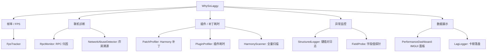

# WhySoLaggy

## 2026-09-21 发行文件准备完成

当前版本 `1.0.5` 的发行文件已按用户要求备齐（2026-09-21），目录 `MOD开发/WhySoLaggy/发行/1.0.5`。包含 DLL、icon.png、README.md、CHANGELOG.md、manifest.json；未生成 ZIP、未上传。DLL 与上一轮通过构建/测试并部署的最终产物一致，完整实机验收仍待完成。

本版覆盖：ModConfig 语言监听、配置归属和补丁警告；重新核对诊断配置及日志说明。

此前发行目录和 ZIP 保留原样；下方旧日期/旧版本状态为历史，不覆盖本节。

## 2026-09-21 当前更新

开发/测试版本 `1.0.5`，PEAK 2.4.b / ModConfig 1.8.2 / PEAKLib.UI 1.7.2 接入已更新。修正 Action 字段订阅、MOD 归属与测试执行链。Release 0 警告 0 错误，DLL 已部署原 2.0.a profile；`发行/1.0.5` 文件已备齐（无 ZIP、未上传），完整实机验收仍待完成。

构建/测试/产物详见 `../ModConfigDiagnostics/INTEGRATION_RESULT_2026-09-21.md`。下方旧日期发布和 hash 为历史记录。

更新时间：2026-09-21

## 项目定位

PEAK 的**性能、网络、RPC、Harmony 和异常行为观测** MOD。定位是项目的"体检仪"，其他 MOD 出性能问题或联机异常时，先挂 WhySoLaggy 抓数据，再定位根因。

本 MOD 不做业务逻辑修改，只做诊断输出。

## 2026-08-31 历史发布状态

- 当时发布/维护版本：`1.0.4`，兼容基线为 PEAK `2.3.a`；`发行\1.0.4` 已建立并包含 ZIP。
- 插件、项目、程序集和文件版本已统一为 `1.0.4` / `1.0.4.0`。
- Release 构建曾以 0 warnings / 0 errors 通过；双客户端远端归因、Ownership 分类和卸载重载仍待实机验收。当前测试源码包含 18 个 `[TestMethod]`，其中最近增加的 ModConfig 分类测试尚需重新跑测试确认。
- `发行\1.0.3\WhySoLaggy.dll` 保持不变，SHA-256 为 `29D2B361F956A5AA94C972932A9DCB39DC58562E78180A83D90CA7E1131BC48B`。
- `发行\1.0.4\WhySoLaggy.dll` 为 `157184` 字节、程序集版本 `1.0.4.0`，SHA-256 为 `CC9FCC52E825088AE254754BF30BF5E58A6A1FA8FA78C5E3DDA0A121B3B71431`；当时 profile DLL 与发行 DLL 一致，当前 profile 已更新为 1.0.5。
- 1.0.4 ZIP 内为五个发行文件：DLL、README、CHANGELOG、manifest 和 icon；ZIP SHA-256 为 `A2B6960F9FA5893EBC3434D391306A4142DAE422F744325D047327F369A0C809`。
- 当前工作区另有未提交的 ModConfig 本地化源码和测试改动；不要把它们视为新的已验收发行版本。
- 诊断模块见 `FILES.md` 的关键源码清单。

## 能力矩阵

```mermaid
graph TD
    A[WhySoLaggy] --> B[帧率 / FPS]
    A --> C[联机诊断]
    A --> D[插件 / 补丁耗时]
    A --> E[异常监控]
    A --> F[数据展示]

    B --> B1[FpsTracker]
    C --> C1[RpcMonitor: RPC 归因]
    C --> C2[NetworkAbuseDetector: 炸房溯源]
    D --> D1[PatchProfiler: Harmony 补丁]
    D --> D2[PluginProfiler: 插件耗时]
    D --> D3[HarmonyScanner: 全量扫描]
    E --> E1[StructuredLogger: 键值对日志]
    E --> E2[FieldProbe: 字段值探针]
    F --> F1[PerformanceDashboard: IMGUI 面板]
    F --> F2[LagLogger: 卡顿落盘]
```

## 用法速查

- **卡顿归因**：看 `PerformanceDashboard` 左上角的 IMGUI 通知（堆叠 + 淡出）。
- **RPC 异常**：查 `RpcMonitor` 输出，单玩家高频 RPC 会被 `NetworkAbuseDetector` 打 warning。
- **字段采样**：改 `测试环境\BepInEx\config\WhySoLaggy.fieldprobe.json`，用 `Type.Method >> 字段表达式1, ...` 的 DSL（详见 `common/03_日志与诊断规范.md`）。
- **Harmony 冲突排查**：`HarmonyScanner` 能扫全体注册的补丁。

## 1.0.4 联机测试开关

- 基础联机验收：`AbuseDetection.EnableAbuseDetection=true`、`RpcMonitor.EnableRpcMonitor=true`、`Logging.LogVerbosity=Normal`。
- 保持默认阈值：`ActorMethodRateThreshold=20`、`OwnershipGrabRateThreshold=10`、`OwnershipRequestRateThreshold=20`、`QueueCapacity=2048`、`PumpBatchSize=32`。
- 首轮不要开启 `EnablePluginProfiling`、`EnablePatchProfiling` 或 `EnableFieldProbe`，避免额外诊断开销干扰网络行为。
- 测试卸载重载时，先确认同一进程内日志继续产生且没有重复 RPC 记录或重复 Harmony patch。

## 接手必读

- `FILES.md`：源码、关键 Helper 清单。
- `RECENT.md`：最近的诊断能力演进。
- `DECISIONS.md`：默认开关策略、数据格式。
- `common/03_日志与诊断规范.md`：日志分级、FieldProbe DSL、JSON 注释禁用。

## 跨 MOD 关系

- **所有其他 MOD** 出联机/性能问题都先挂 WhySoLaggy 跑一遍。
- 与 `Lantern_ShootZombies_Night` 联动：它的 `RoomConfigSyncHelper` 广播配置时可被 `RpcMonitor` 观测。
- 与 `DreamyAscent` 联动：运行时 `Instantiate` 卡顿可用 `PluginProfiler` 归因。
